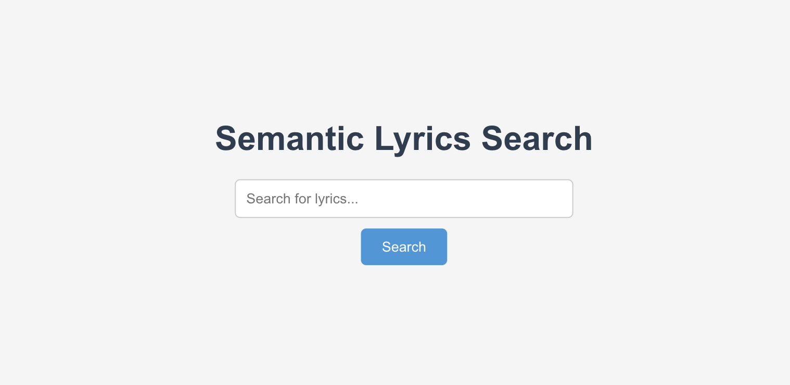
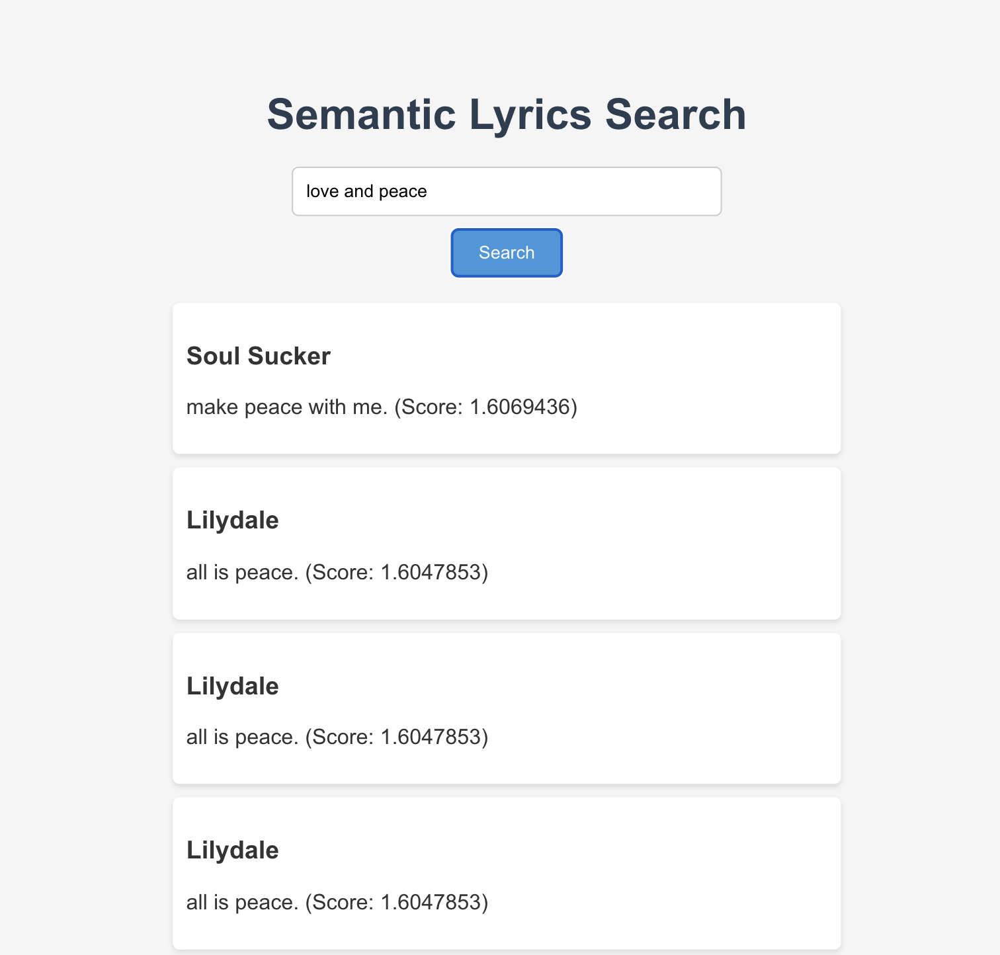

# document-retrieval-vector-db-application - Semantic Lyrics Search Application
Final Project for ELEN-6776 Content Storage and Distribution Networks

This project is a full-stack web application that allows users to search for song lyrics using both standard and semantic search techniques. It uses Elasticsearch for data storage and retrieval, and a Python Flask backend with GraphQL for handling search queries.

## Features

### Standard Lyrics Search
Standard search allows users to find lyrics using traditional text search methods.

### Semantic Lyrics Search
Semantic search uses NLP techniques to find lyrics based on the context and meaning of the query.

## User Interface

Here's a look at the user interface of the application:

[//]: # (![UI Screenshot]&#40;.github/ui.png&#41;)
 

[//]: # (## Architecture)

And here is a look at the search result of text:"love and peace":

